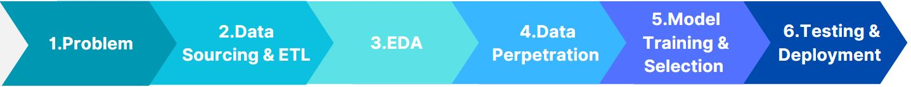
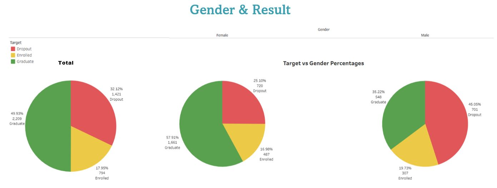
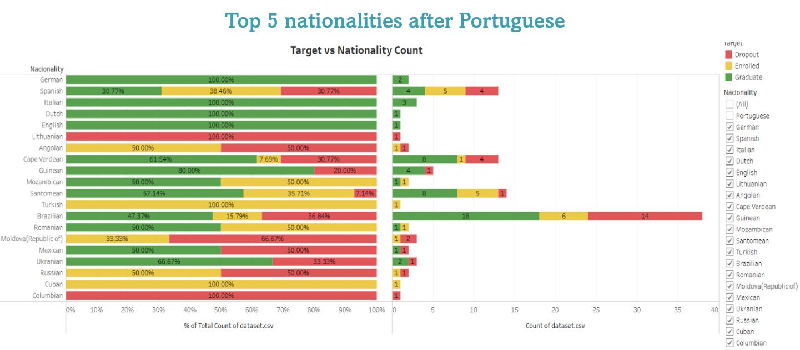
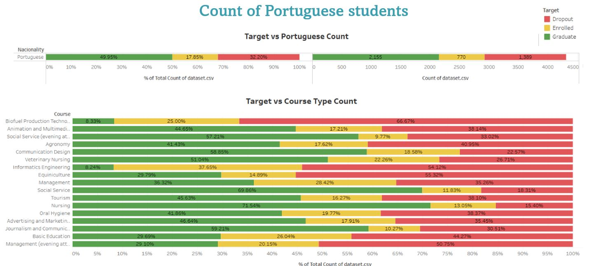
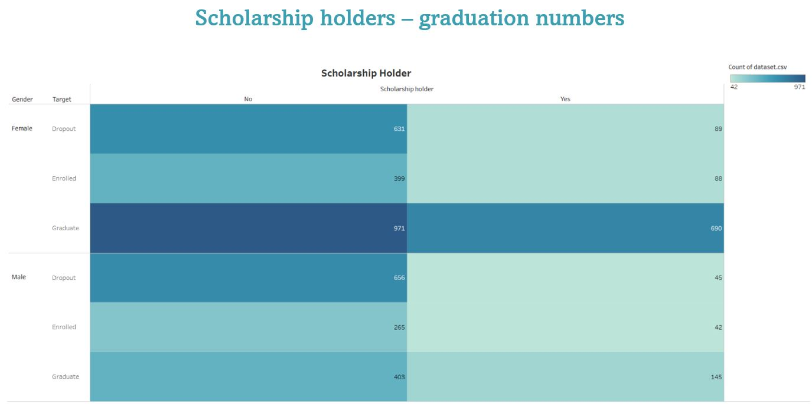
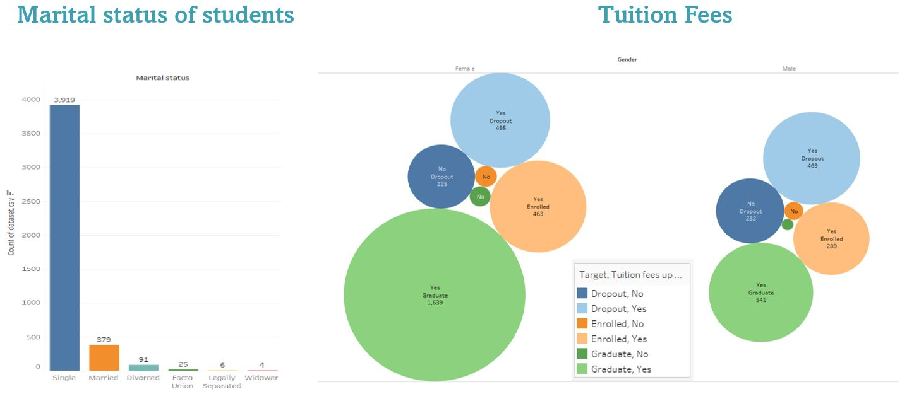
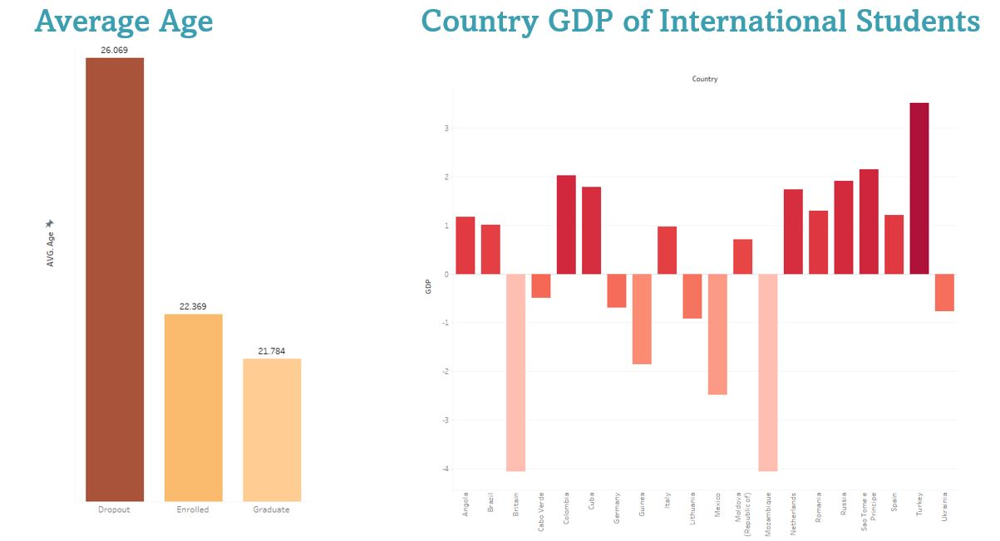
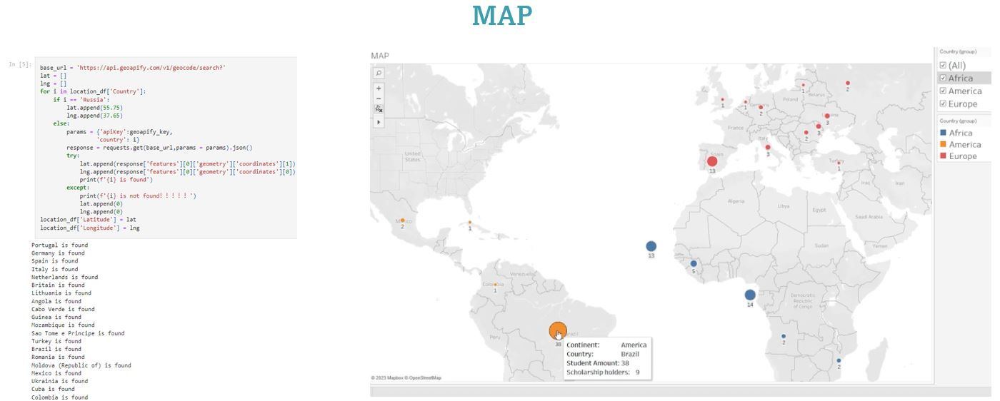
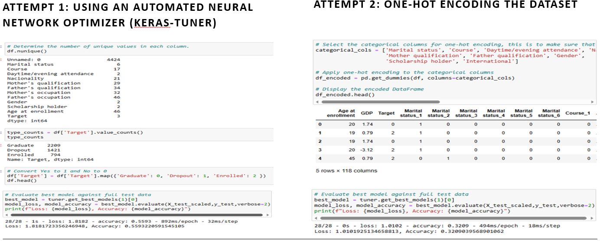

# PROJECT_4

## To Graduate Or Not To Graduate - That Is the Question
Team Members - Hamim Hussain, Hanwen Jia, Sultana Khan

### Executive Summary:
Higher education institutes collect vast amounts of data on students, offering an excellent opportunity to gain insights and knowledge. This project focuses on a dataset that combines demographic, socioeconomic, macroeconomic, and academic information from various sources, covering enrollment and academic performance at a Portuguese institute during the 2018/2019 academic year. The objective is to build machine learning models capable of predicting students' likelihood of graduation.

Initially, the project examined factors correlated with the "Target" column in the dataset, such as gender, marital status, and tuition fees. Visualisations created using Tableau highlighted the relationships. The data was cleaned using the pandas library in Python to prepare it for both supervised and deep learning models.

Key findings from the data analysis reveal that female students have a higher graduation rate than male students, while male students have a higher dropout rate. Among the top nationalities, Brazilian students represent the largest group, followed by Santomean, Cape Verdean, and Spanish students. Traditional vocational courses demonstrate higher graduation rates compared to more specialized ones. Additionally, financial aid positively impacts the dropout rate, suggesting that students with financial support are more likely to complete their studies.

Further analysis indicates that students from countries with a positive GDP growth rate and younger students are more likely to graduate successfully. The project also involves retrieving location data through an API to create maps of international students' resources and visualize applied continent filters and basic student information.

The initial machine learning attempts involved using an automated neural network optimiser called Keras Tuner, which resulted in a relatively low accuracy score of 0.559. One-hot encoding the dataset in the second attempt led to even lower accuracy due to the introduction of excessive noise (117 columns). To overcome these challenges, data reduction techniques were applied, and a correlation map was used to identify the most important features for better accuracy.

PyCaret, a low-code machine learning library, was utilised to streamline the workflow. Gradient Boosting Classifier was selected as the best model, achieving an accuracy score of 0.8228 after tuning. Furthermore, deep learning techniques were reintroduced, employing Keras Tuner to optimise the neural network model, resulting in a significant accuracy improvement to 0.86.

Overall, the Keras Tuner model showcased better precision, recall (except for Class 0 - Dropout), and accuracy compared to the PyCaret model, indicating its superior performance in predicting student graduation or dropout.

While this project yields valuable insights, there are limitations to consider, including the timeframe of data collection, limited definitions of dropout, and specific columns' significance. However, the ability to predict graduation rates holds economic implications for a country's development. By identifying courses with low graduation rates and providing appropriate support, economies can nurture job opportunities, promote social justice, and foster overall economic growth.

### Introduction:
Higher education institutions possess a wealth of student data that has the potential to yield valuable information, knowledge, and monitoring capabilities. However, the persistent challenges of school dropout and educational failure in higher education hinder economic growth, employment prospects, competitiveness, and productivity, affecting students, institutions, and society as a whole. This project utilises a comprehensive dataset combining demographic, socioeconomic, macroeconomic, and academic information to construct machine learning models that predict academic performance and identify potential dropout cases.

By leveraging this dataset, the project aims to uncover insights that can enable proactive measures to mitigate academic challenges and enhance educational success. By harnessing the power of data-driven predictive modeling, higher education institutions can make informed decisions and implement targeted interventions to support students, thereby improving graduation rates and fostering positive socioeconomic outcomes. The subsequent sections will delve into the methodology employed, encompassing machine learning techniques, data preprocessing, feature engineering, and model evaluation, with the ultimate goal of empowering educational strategies and ensuring the success of students within higher education.

The following sections will delve into the methodology employed to approach this project, including the utilisation of machine learning techniques, data preprocessing, feature engineering, and model evaluation. The findings and insights gained from this analysis hold the potential to inform educational strategies, contribute to the improvement of graduation rates, and ultimately impact the socioeconomic landscape by ensuring the success of students within higher education institutions.

### Approach:

#### 1. Problem:
The primary objective of this project is to predict whether a student will graduate or drop out based on various circumstances. Additionally, we aim to gain insights into the factors influencing student outcomes through data visualization.

#### 2. Data Sourcing & ETL:
The dataset for this project was sourced from the following link: 

https://www.kaggle.com/datasets/thedevastator/higher-education-predictors-of-student-retention

We downloaded the CSV dataset and performed Extraction, Transformation, and Loading (ETL) processes. Using pandas and Python, we cleaned and structured the data. We also utilized an API data collection method to obtain latitude and longitude data for countries, which we later joined with the dataset for map creation. We loaded the cleaned dataset into Tableau for visualisations and Google Collab for deep machine learning and supervised learning purposes.

#### 3. Exploratory Data Analysis:
We conducted in-depth investigation and evaluation of the raw data. Through visualisations in Tableau, we gained a better understanding of the data, checked for missing values, assessed overall data quality, examined categorical features, and explored correlations with the 'Target' column. We also analysed the distribution of the 'Target' column to identify the proportions of students who graduate or drop out.

#### 4. Data Preparation:
Data preparation involved various tasks to ensure the dataset is suitable for machine learning algorithms. These tasks included train-test-split, missing value imputation, scaling, transformation, feature engineering, and extraction. By completing these steps, we ensured that the dataset was in optimal shape for subsequent machine learning processes.

#### 5. Model Training & Selection:
Multiple models were created using PyCaret and Keras Tuner. We trained and evaluated these models, comparing their performance and selecting the most suitable model for our objective. This involved fitting multiple estimators, tuning hyperparameters, and employing techniques to improve model accuracy.

#### 6. Testing & Deployment:
To assess model performance and suitability for production, we tested our selected model on unseen data. This evaluation allowed us to determine the model's effectiveness before deploying it in a real-world setting. The final step involved finalizing the best-performing model that satisfied our project objective and could be utilized for future deployments.

By following this approach, we aimed to accurately predict student outcomes, understand the factors influencing graduation or dropout rates, and ultimately contribute to improving educational strategies and student success in higher education.

### Findings:
Upon conducting a comprehensive analysis and employing various modeling techniques, this section presents the significant findings and insights gained from our investigation. The findings shed light on the factors influencing student outcomes, the predictive power of our machine learning models, and offer valuable implications for educational strategies and interventions. By delving into the following subsections, we aim to uncover the noteworthy findings derived from our data-driven approach.

#### Tableau:

* Under 50% of students have graduated, and when looking at the gender differences, female students have a higher percentage of graduation to male, with significantly more male students dropping out at 45%.

* This shows the top 5 nationalities are Brazilian(38), Santomean, Cape Verdean and Spanish (all at 13-14) after most Portuguese (4314) students.

* From the course type, the top 3 for most graduates are Nursing, Social Services and Journalism & Communication. The lowest being Biofuel Technology and Equiniculture. It appears that traditional vocational courses secure a higher degree of success for graduation than courses which are more specialised.

* This shows that students do graduate in higher numbers without scholarship for both male and female, however the figures are much lower for dropping out when holding a scholarship – this indicates having financial support could help with students completing their course.

* From the data on marital status, most students are single, and when looking at tuition fees being paid, the figures are similar for both male and female, again noticeable is that female students are graduating in higher numbers. Additionally, what is worth noting is, there are only a very small number of graduates with fees not up to date.

* Most of international students are from positive GDP growing Country
* Younger students are more likely to gradate successful.
* Older students are more likely to Dropout

  
* Retrieve location data via API. Create map of International students’ resources. Also map applied contains continent filter and student basic information such as 'Student Amount', 'Scholarship holders' and more.  

* Attempt 1: Using an Automated Neural Network Optimizer (Keras-Tuner):
    * We looked at using an automated neural network optimizer called Keras Tuner. which can implement multiple layers, activation functions and nodes.
    * It aims mimic the complexity of the human brain by connecting data points.
    * We used the tableaus visualisation and our instincts to determine the most important features.
    * We got an accuracy score of 0.559, which is quite
 
* Attempt 2: One-Hot Encoding the Dataset:
    * One-hot encoding converts categorical data into binary values, allowing the algorithm to treat them as categories rather than numerical values.
    *  However, this approach can lead to problems when the number of categories becomes too high.
    *  In our case, we ended up with 117 columns after one-hot encoding, which introduced a lot of noise.
    *  The accuracy was even lower, with a score of 0.32. 

### Conclusion:

### References:
